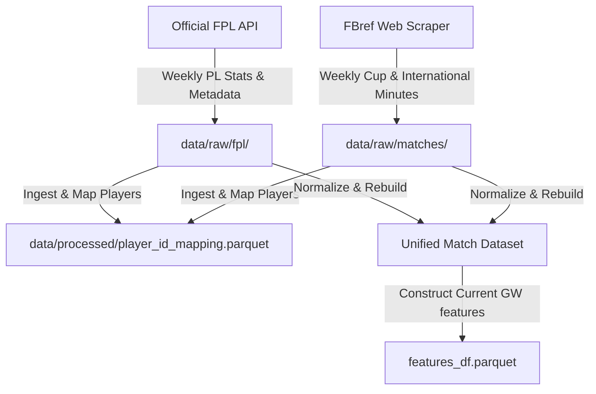

# Audit of Existing FPL Data Pipeline & Current Ingestion Sources

This document audits the historical data pipeline, player/team identifiers, features, and evaluates candidate free/open data sources for live in-season updates and external cup/international match tracking.

---

## 1. Audit of the Historical Data Pipeline

### A. Historical Data Sources
We use the **Vaastav Fantasy Premier League GitHub repository** as our historical data source. The files loaded from it are:
* `data/<season>/gws/gw<n>.csv`: Player performance stats per gameweek (points, minutes, goals, assists, saves, bonus, bps, transfers, ownership).
* `data/<season>/players_raw.csv`: Player metadata (names, codes, positions, prices, current team IDs).
* `data/<season>/fixtures.csv`: Fixture details (fixture IDs, gameweeks, home/away difficulties, final scores).
* `data/<season>/teams.csv`: Team metadata (team names, short names, strength scores).

### B. Player & Team Identification
* **Players**:
  * Identified by `player_id` (season-specific FPL element ID, e.g. `234` is Bukayo Saka in 2024-25, but could be a different player in other seasons).
  * Unique key: `(season, player_id)`.
  * Stable identifier: `code` (FPL's stable integer code, which remains constant for a player across all seasons).
* **Teams**:
  * Identified by `id` in `teams.csv` (season-specific, e.g., 1 is Arsenal in 2023-24).
  * Linked to players via `team` in `players_raw.csv` (which is mapped to `season_team_id` in our features).
* **Fixtures**:
  * Identified by `id` in `fixtures.csv`. Mapped using `team_h`, `team_a`, and `event` (gameweek).

### C. Feature Engineering Scheme
The processed parquets (`player_gw.parquet`, `players.parquet`, `fixtures.parquet`, `teams.parquet`) are converted into a unified feature set `features_df.parquet` by `run_feature_engineering_pipeline()` in `src/features/build_features.py`:
1. **Player rolling features** (last 1, 3, 5, 10 matches) are calculated chronologically from `player_gw` rows (expected stats, points, minutes, assists, goals, ICT index, value, price, transfers balance).
2. **Team rolling form** is calculated from team goals scored/conceded in previous matches.
3. **Fixture features** are joined to capture double gameweeks (DGWs), blank gameweeks (BGWs), and opponent strengths.
4. **Targets** (`target_points`, `target_minutes`, `target_60_plus_minutes`) are defined from current-GW actuals, which are then dropped from the training features to prevent data leakage.

### D. Production Model Feature Requirements
The production LightGBM model requires all 8 categories of features defined in `config/config.yaml`:
* `player_base_rolling`: rolling points, minutes, starts, goals, assists, ICT, bps, saves, tackles.
* `player_expected`: rolling xG, xA, and expected goal involvements (xGI).
* `player_derived`: points per 90, saves per 90.
* `player_value_ownership`: prices, transfer in/out ratios, selected ratios.
* `player_experience`: gameweeks played, minutes this season.
* `fixture_aggregates`: num_fixtures, was_home, difficulties, double GW flag.
* `team_rolling`: team/opponent rolling goals scored and conceded.
* `team_static`: opponent static attack/defence ratings.

---

## 2. Evaluation of Live & External Data Sources

To support current weekly predictions and decision optimization, we need live in-season updates and external cup/international match tracking.

### Candidate 1: Official FPL API (FPL-Specific)
* **API URLs**:
  * Bootstrap data: `https://fantasy.premierleague.com/api/bootstrap-static/`
  * Gameweek fixtures: `https://fantasy.premierleague.com/api/fixtures/`
  * Player detail history: `https://fantasy.premierleague.com/api/element-summary/{player_id}/`
* **Data Provided**: Complete live player details (prices, ownership, transfers, status/injury news), upcoming fixtures, and detailed actual gameweek performances (minutes, points, goals, assists, bonus, cards, etc. for the current season).
* **API limits**: None explicitly documented (generous rate-limits).
* **API Key**: Not required.
* **Reliability**: Extremely high.
* **Player/Team IDs**: FPL IDs (perfect match with historical data).
* **Automated Weekly Ingestion**: Yes (Primary choice for FPL metadata and Premier League match actuals).

### Candidate 2: FBref HTML Scraper (External Cup/Match Data)
* **Source**: Scraped match logs from `https://fbref.com` (using standard Python libraries).
* **Data Provided**: Detailed match logs and player statistics (starts, minutes, goals, assists, xG, xA, cards) across Premier League, Champions League, Europa League, FA Cup, League Cup, and international matches.
* **API limits**: Rate-limited to 20 requests per minute to avoid being blocked.
* **API Key**: Not required.
* **Reliability**: High, but subject to HTML layout layout changes.
* **Player/Team IDs**: Requires fuzzy name-matching and club mapping.
* **Automated Weekly Ingestion**: Yes, for out-of-FPL cup matches and international match minutes.

### Candidate 3: API-Football (Free Tier)
* **API Provider**: `https://www.api-football.com`
* **Data Provided**: Match fixtures, team lineups, and player match-level statistics for PL, Champions League, Europa League, FA Cup, and League Cup.
* **API limits**: 50 free requests per day (too low for complete weekly player updates across all teams).
* **API Key**: Required (free signup).
* **Player/Team IDs**: Custom API-Football IDs. Requires custom mapping table.
* **Automated Weekly Ingestion**: No (free tier is too restrictive for full squad updates).

---

## 3. Selected Ingestion Architecture
We will implement the smallest reliable set of sources covering FPL and external cup competitions:

1. **Official FPL API**: Ingests bootstrap static information (current price, transfer ratios, selected ratios, injury status) and element summaries (actual gameweek-by-gameweek player scores).
2. **FBref Web Scraper**: Scrapes Champions League, Europa League, FA Cup, and League Cup match pages to retrieve player minutes, starts, and goals.
3. **Player Identity Mapping**: A persistent mapping table (`data/processed/player_id_mapping.parquet`) links FPL `code` to FBref player profile IDs using name-matching with human verification overrides.
