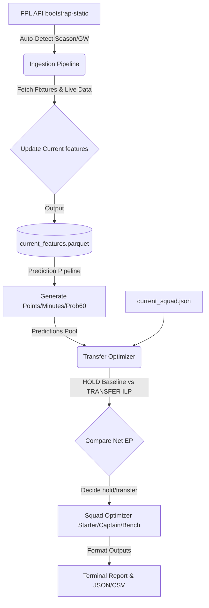

# Phase 9: Production Weekly Decision Pipeline Walkthrough

This document outlines the architecture, data ingestion principles, and operational workflow for the Phase 9 Production Weekly Decision Pipeline.

---

## 1. Overall Architecture

The production weekly decision pipeline integrates data scraping, feature engineering, predictive modeling, and linear programming optimization into a single, unified execution path. 



---

## 2. In-Season Ingestion & Separation of Data

To prevent target leakage and data corruption, we maintain a strict boundary between training data and active inference data:
*   **Historical Data (`data/processed/features_df.parquet`)**: Kept byte-for-byte unchanged. It represents the historical player logs used solely to train the production models.
*   **Current Inference Data (`data/processed/current_features.parquet`)**: Regenerated dynamically on each weekly run. It only holds features and metadata compiled for the active upcoming gameweek, with target points set to `0.0`.

---

## 3. Ingesting Official FPL API Data

We fetch data using standard-library `urllib.request` from the authoritative official FPL endpoints:
*   `/api/bootstrap-static/` — General team, player registry, prices, availability, and next GW deadline details.
*   `/api/fixtures/` — Future and scheduled fixtures of the target season.
*   `/api/event/{gw}/live/` — Player match logs for completed gameweeks.

---

## 4. Point-in-Time Cutoff & Leakage Guards

To prevent chronological information leakage:
1.  **Strict deadline filter**: Rolling averages and features only aggregate matches completed **before** the upcoming target gameweek cutoff time.
2.  **Target GW stats exclusion**: All raw player statistics for the target gameweek (points, goals, minutes) are stripped/mocked to `0` prior to model prediction.
3.  **Active leakage check**: A shield checks all feature inputs before feeding them to LightGBM. If any prohibited target columns or raw stats are detected, the pipeline halts immediately.

---

## 5. Expectation Points Prediction

The pipeline loads the production models. It first attempts to load Optuna-tuned parameters from `config/tuned_lightgbm.yaml` and trains the production LightGBM model on all historical data prior to the target season/GW.
Predictions are made for:
1.  **Expected Points**: Clipping values at `0.0`.
2.  **Expected Minutes**: Enforcing a bound of `[0, 90]`.
3.  **Expected Probability of Playing 60+ Minutes**: Enforcing a bound of `[0, 1]`.

---

## 6. Transfer and Squad Optimization (ILP)

*   **HOLD Strategy**: Re-optimizes the user's current 15-player squad (using `optimize_squad`) to identify the best starting XI, captain, vice-captain, and bench order.
*   **TRANSFER Strategy**: Solves an Integer Linear Programming (ILP) model via `pulp` and COIN-OR CBC to identify the optimal squad and transfer actions. It incorporates FPL squad rules:
    *   Squad size: Exactly 15 players (2 GK, 5 DEF, 5 MID, 3 FWD).
    *   Starting XI: Exactly 11 starters.
    *   Formation rules: 1 GK, >= 3 DEF, >= 1 MID, >= 1 FWD.
    *   Budget: Total squad value cannot exceed the selling price of the current squad + remaining bank cash.
    *   Max 3 per club: Enforced based on the players' **current** clubs.
    *   Captaincy: Captain and Vice-captain must be unique starting players.
    *   Penalty: Deduces -4 points per transfer exceeding the available free transfers count.

The pipeline compares:
$$\text{Net } EP_{\text{TRANSFER}} = EP_{\text{TRANSFER\_XI}} + EP_{\text{TRANSFER\_CAPTAIN}} - 4 \times (\text{Transfers} - \text{Free Transfers})$$
versus
$$EP_{\text{HOLD}} = EP_{\text{HOLD\_XI}} + EP_{\text{HOLD\_CAPTAIN}}$$
If $\text{Net } EP_{\text{TRANSFER}} > EP_{\text{HOLD}}$, it recommends **TRANSFER**; otherwise it recommends **HOLD**.

---

## 7. BGW / DGW / Postponed Fixture Aggregates

*   **Double Gameweek (DGW)**: If a team has multiple matches scheduled in the target gameweek, the predictions pipeline automatically aggregates the player's expected points across all fixtures.
*   **Blank Gameweek (BGW)**: If a team has no fixture, their expected points are set to `0.0`.

---

## 8. External Data Status

The pipeline supports workload and fixture congestion features. However, offline Champions League, FA Cup, and international matches are not hard dependencies. If external logs are missing, the pipeline logs the external enrichment status as `UNAVAILABLE` or `PARTIAL` and runs prediction safely using Premier League/FPL data alone.

---

## 9. Selling Price Limitation

Purchasing prices and profit taxes are not tracked in the current database. We enforce the current Phase 5 simplification that **selling price equals the player's current price**.

---

## 10. Weekly Operating Procedure

### Setup Current Squad
Before running the decision pipeline, ensure your current squad is updated in `data/input/current_squad.json`:
```json
{
    "players": [
        101, 102, 103, 104, 105, 106, 107, 108, 109, 110, 111, 112, 113, 114, 115
    ],
    "free_transfers": 1,
    "bank": 0.5
}
```

### Run the Pipeline Automatically
To run for the next upcoming gameweek (auto-detecting season and GW):
```bash
python -m src.pipeline.weekly_decision
```

### Run for a Specific Season / GW
To run historical tests or override GW detection:
```bash
python -m src.pipeline.weekly_decision --season 2025-26 --gw 2 --bank 0.5 --free-transfers 1
```

---

## 11. Example Output Report

When executed, the pipeline logs the following output:

```
==================================================
FPL WEEKLY DECISION
Season: 2025-26
Target GW: 2
Deadline: 2025-08-18T17:30:00Z

DATA STATUS
FPL data: AVAILABLE
External enrichment: UNAVAILABLE
Point-in-time cutoff: PASS
Leakage guard: PASS

MODEL
Production model: tuned_lightgbm
Prediction rows: 680
--------------------------------------------------
HOLD
Expected points: 52.40
--------------------------------------------------
TRANSFER RECOMMENDATION
Decision: TRANSFER

Transfers OUT:
- Player 104 (DEF) £5.0m

Transfers IN:
- Player 117 (DEF) £6.5m

Transfers: 1
Free transfers: 1
Hits: 0
Transfer penalty: -0.0

Expected points after transfer: 55.40
Net expected points: 55.40
Improvement vs HOLD: +3.00
--------------------------------------------------
FINAL STARTING XI
Formation: 3-5-2

GK:
- Player 101 £5.0m | Exp: 4.00

DEF:
- Player 103 £6.0m | Exp: 5.00
- Player 117 £6.5m | Exp: 6.00
- Player 105 £4.5m | Exp: 2.50

MID:
- Player 108 £8.5m | Exp: 7.00
- Player 118 £12.5m | Exp: 9.50
- Player 110 £7.0m | Exp: 4.50
- Player 111 £6.5m | Exp: 4.00
- Player 112 £6.0m | Exp: 3.80

FWD:
- Player 113 £9.5m | Exp: 6.50
- Player 119 £14.0m | Exp: 10.50 (C)

Captain: Player 119
Vice-Captain: Player 118 (VC)

BENCH
GK: Player 102 £4.5m | Exp: 3.50
1: Player 109 £7.5m | Exp: 5.50
2: Player 106 £4.0m | Exp: 2.00
3: Player 107 £4.0m | Exp: 2.20

Squad cost: £104.0m
Remaining bank: £0.0m
==================================================
```
